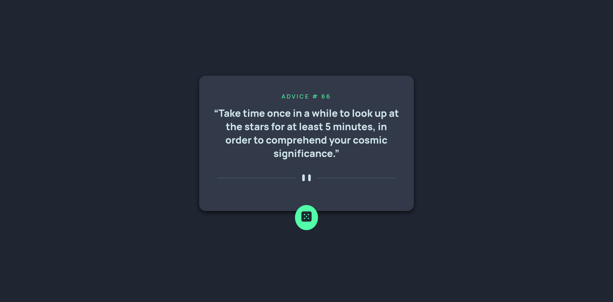

Frontend Mentor - Advice Generator App Solution

This is a solution to the Advice Generator App challenge on Frontend Mentor
. Frontend Mentor challenges help you improve your coding skills by building realistic projects.

Table of contents

Screenshot

Links

Built with

What I learned

Continued development

Useful resources

Author

Users should be able to:

🖥️ View the optimal layout for the app depending on their device's screen size

🎨 See hover states for all interactive elements on the page

🎲 Generate a new piece of advice by clicking the dice icon

⏳ See a smooth loading animation while new advice is being fetched

Screenshot

Links

🔗 Solution URL: https://github.com/Fabiha517/Advice-generator-app.git

🌐 Live Site URL: https://fabiha517.github.io/Advice-generator-app/

Built with

✅ Semantic HTML5 markup

🎨 CSS custom properties & Flexbox

📱 Mobile-first workflow

💻 Vanilla JavaScript for API fetch and animations

⏳ Skeleton loader for smooth loading effect

What I learned

🌐 Working with the Advice Slip API
to fetch dynamic advice

⏳ Implementing a skeleton loader to prevent the container from appearing empty

⚡ Using async/await and try/catch for clean API requests and error handling

✨ Adding smooth pop-in/fade animations for a polished user experience

📏 Maintaining a stable container height with min-height to avoid layout jumps

Continued development

🎨 Experiment with different animation styles (fade, slide, pop)

🗄️ Implement caching to avoid repeated API calls

📱 Refine responsive typography and layout for larger screens

Useful resources

🌐 Advice Slip API

- Official API documentation for fetching advice

🏗️ Frontend Mentor

- Challenge inspiration and design guidance

🎬 CSS Animations

- For smooth pop-in/fade effects

Author

👤 Name: [Your Name]

🖥️ Frontend Mentor - @Fabiha517
